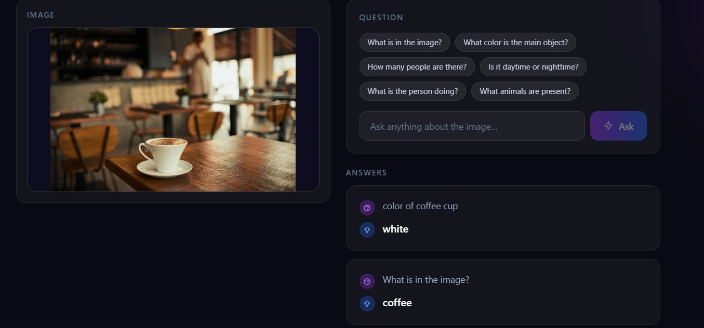
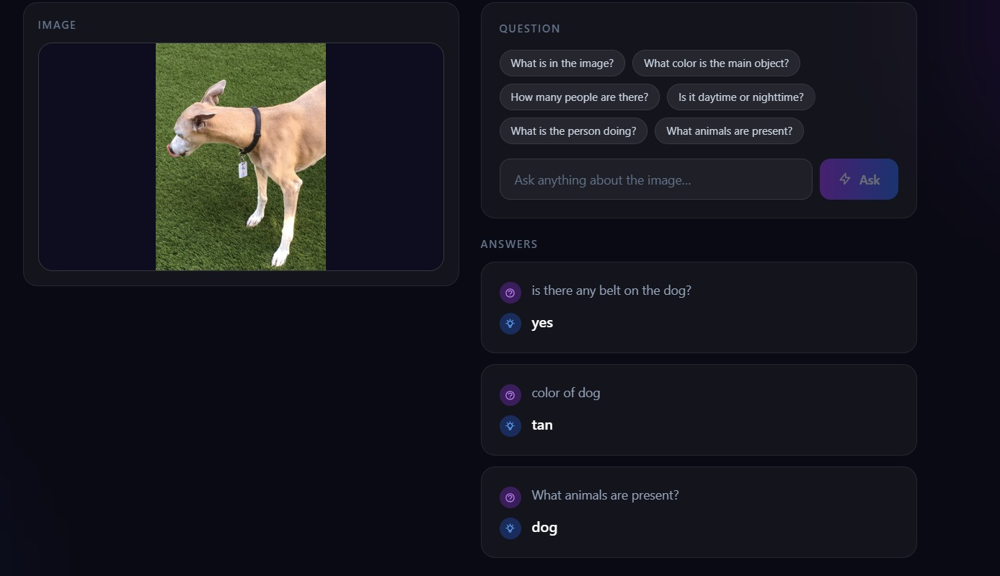

<div align="center">

# Visual Question Answering Assistant

**Ask anything about an image — in plain English.**

[](https://python.org)
[](https://pytorch.org)
[](https://react.dev)
[](https://fastapi.tiangolo.com)
[](LICENSE)

</div>

---

## Overview

A full-stack multimodal AI application that accepts any image and a natural-language question, then generates a concise answer using **BLIP** (Bootstrapped Language-Image Pre-training). Built to demonstrate modern AI engineering — from model integration and REST API design to a production-ready React frontend.

---

## Output

<table>
  <tr>
    <td align="center"><b>Coffee shop scene</b></td>
    <td align="center"><b>Animal recognition</b></td>
  </tr>
  <tr>
    <td></td>
    <td></td>
  </tr>
  <tr>
    <td>
      Q: <i>What is in the image?</i> → <b>coffee</b><br/>
      Q: <i>Color of coffee cup?</i> → <b>white</b>
    </td>
    <td>
      Q: <i>What animals are present?</i> → <b>dog</b><br/>
      Q: <i>Is there any belt on the dog?</i> → <b>yes</b><br/>
      Q: <i>Color of dog?</i> → <b>tan</b>
    </td>
  </tr>
</table>

---

## Tech Stack

| Layer | Technology |
|---|---|
| **AI Model** | `Salesforce/blip-vqa-base` — fine-tuned on VQAv2 |
| **Backend** | FastAPI + Uvicorn |
| **Frontend** | React 18 · TypeScript · Vite · Tailwind CSS |
| **Inference** | HuggingFace Transformers (local) |
| **Deployment** | Vercel (frontend) · Docker-ready backend |

---

## Architecture

```
User (Browser)
      │
      │  upload image + question
      ▼
 React Frontend  ──────────────────────────────────┐
 (Vercel)                                          │
      │  POST /api/predict                         │
      │  { image_b64, question }                   │
      ▼                                            │
 Vercel Serverless Function                        │
 (api/predict.ts)                                  │
      │                                            │
      │  calls HuggingFace Inference API           │
      ▼                                            │
 BLIP VQA Model                                    │
 (Salesforce/blip-vqa-base)                        │
      │                                            │
      │  { answer }                                │
      └────────────────────────────────────────────┘
```

**Model internals:**

```
Image (224×224)            Question (text)
      │                          │
  ViT Encoder               Text Encoder
  (patch embeddings)        (BERT-style)
      │                          │
      └──────── Cross-Attention ─┘
                     │
               Answer Decoder
                     │
              Generated Answer
```

---

## Project Structure

```
Visual Question Answering Assistant/
│
├── api.py                   # FastAPI backend (local dev / Docker)
├── requirements_api.txt     # Backend dependencies
├── Dockerfile.local         # Docker config for local runs
├── render.yaml              # Render deployment config
│
├── frontend/
│   ├── api/
│   │   └── predict.ts       # Vercel serverless function → BLIP inference
│   ├── src/
│   │   ├── App.tsx           # Root component
│   │   ├── api.ts            # API client
│   │   └── components/
│   │       ├── Header.tsx
│   │       ├── ImageUpload.tsx   # Drag-and-drop upload
│   │       ├── QuestionInput.tsx # Example chips + input
│   │       ├── AnswerCard.tsx    # Q&A history display
│   │       └── ErrorBanner.tsx
│   ├── vercel.json
│   └── package.json
│
├── models/                  # Custom ResNet+BERT model (educational)
│   ├── image_encoder.py
│   ├── text_encoder.py
│   ├── fusion.py
│   └── vqa_model.py
│
├── utils/
│   ├── dataset.py
│   ├── preprocessing.py
│   ├── metrics.py
│   └── visualization.py
│
└── data/
    └── generate_synthetic.py
```

---

## Local Setup

### Prerequisites
- Python 3.11+
- Node.js 18+
- HuggingFace token (free — [hf.co/settings/tokens](https://huggingface.co/settings/tokens))

### Backend

```bash
# 1. Create virtual environment
python -m venv venv
venv\Scripts\activate        # Windows
# source venv/bin/activate   # macOS/Linux

# 2. Install dependencies
pip install -r requirements_api.txt
pip install torch torchvision transformers --extra-index-url https://download.pytorch.org/whl/cpu

# 3. Configure environment
echo USE_LOCAL_MODEL=true > .env
echo HF_TOKEN=hf_your_token >> .env

# 4. Start backend (port 7860)
uvicorn api:app --host 0.0.0.0 --port 7860 --reload
```

### Frontend

```bash
cd frontend
npm install
npm run dev          # starts at http://localhost:5173
```

Open **http://localhost:5173** — the app connects to your local backend automatically.

> On first request, BLIP (~1 GB) downloads from HuggingFace and caches locally. Takes ~30 s once, then loads from disk.

---

## Model Details

**BLIP (Bootstrapped Language-Image Pre-training)**

| Property | Value |
|---|---|
| Model | `Salesforce/blip-vqa-base` |
| Training data | VQAv2 (1.1M QA pairs, COCO images) |
| Architecture | ViT image encoder + BERT-style text encoder + cross-attention |
| Answer type | Open-ended (generative, not classification) |
| Parameters | ~247M |

Works best on: everyday scenes, animals, food, people, colours, counting, yes/no questions.

---

## Custom Model (Educational)

The `models/` directory contains a from-scratch **ResNet-50 + BERT + Cross-Attention** VQA model built for learning:

```
Image → ResNet-50 → 49 visual tokens (512-dim)
Text  → BERT      → contextual token embeddings (512-dim)
                      ↓
              Bidirectional Cross-Attention (×2 layers)
                      ↓
              MLP Classifier → 35 answer classes
```

Train it on the synthetic dataset:
```bash
python train.py --epochs 15 --batch 16
```

---

## License

MIT — free to use for educational and personal projects.

---

<div align="center">
Built with PyTorch · HuggingFace Transformers · FastAPI · React · Vite
</div>
